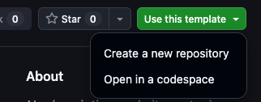
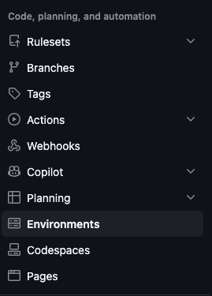
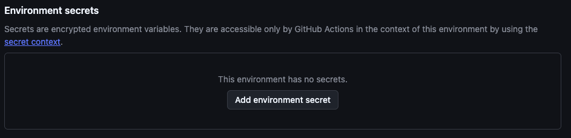
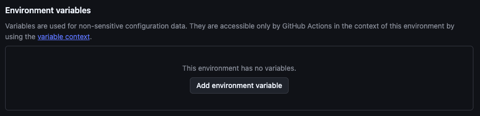

# Cloudflare Workers Template

A minimal, production-shaped starting point for a Cloudflare Worker: one working placeholder Worker, tests that run locally in a real Workers runtime, separate non-production and production environments, and a documented release path.

This is a GitHub template repository. Create your own project from it, then add your application code. Nothing here deploys to Cloudflare until you deliberately turn deployment on.

## What you get

- A minimal Worker in [src/index.js](src/index.js) with an explicit `fetch` handler.
- Tests that execute in the Workers runtime locally through Miniflare (`@cloudflare/vitest-pool-workers`); no Cloudflare account required to start.
- Contract tests that fail if non-production and production configuration get crossed.
- Separate `non-prod` and `production` Wrangler environments, with deployment disabled by default.
- A documented branch, promotion, and release workflow.

## Quickstart (via Template)

1. **Create your repository.** 

   Select *Use this template* on GitHub for a clean start.  This will create a **new** repo under your account on GitHub that contains the project assets.

   

   Additional options exist - see [Choosing how to start](docs/using-this-template.md#choosing-how-to-start).

2. **Clone it and install.** 

   Clone the repository you *just* created, not this template repo.

   ```sh
   git clone https://github.com/YOUR-OWNER/YOUR-REPOSITORY.git
   cd YOUR-REPOSITORY
   npm install
   ```

3. **Name your Workers.** 

   Change the three `name` fields in [wrangler.jsonc](wrangler.jsonc) from `cloudflare-workers-template` to your own project slug, keeping the `-non-prod` and `-production` suffixes. Update `name` in [package.json](package.json) to match.

4. **Run it locally.** 

   No Cloudflare account is needed for development and testing.  You *will* need an account to deploy this to Cloudflare infrastructure.  
   
   You can work as long as you want on testing/dev or just to learn without doing that. But when you want it to go live? You need accounts.

   ```sh
   npm run dev
   ```

5. **Confirm the guardrails still pass.** 

   The contract tests check that your two environments are distinct.

   ```sh
   npm test
   ```

6. **Create the `develop` branch.** 

   Feature work merges into `develop`; releases go out from `main`.

   ```sh
   git switch -c develop
   git push -u origin develop
   ```

7. **Turn on deployment when you are ready.** 

   *THIS* is where you need a Cloudflare account.  If you don't already have one, go get one. (Instructions for this are outside the scope of this repo.)

   With a working Cloudflare account:
   - Obtain your Cloudflare API token and account ID from your Cloudflare account.  *KEEP THESE SECRET!*

   - In GitHub, under "Settings" in the top menu bar for the repo:
       

      - open the "environments" from the side menu in Settings

         

      - create environments for production and non-prod.  There's a "New Environments" button at the top of the environments main screen.

      - You can leave the defaults alone for now when creating the environments EXCEPT we need to add the secrets and variable.

         - adding secrets is done in the hopefully obvious place on the new environment page. (If you left the page after creating the environment, you can always come back to do this.)

            

         - configure the Cloudflare API token and account ID as secrets.  The secret name MUST follow the defined patterns of:

            - `CLOUDFLARE_ACCOUNT_ID`
            - `CLOUDFLARE_API_TOKEN`

               

         - adding a non-secret variable is just below where you add the secret. 

            

            - create a variable called `DEPLOY_ENABLED` and set to `true` if you are ready to start deployments. 
            
            If you aren't ready to deploy or want to pause deployments, you can set it this deploy variable to `false`.  The presence of the variable isn't enough; it needs to be set to `true` for the automation to run.


Note that if you did all of this, the GitHub action that deploys will run on the *next* push to `develop` or `main`. 
               
See [Configure GitHub environments and secrets](docs/using-this-template.md#4-configure-github-environments-and-secrets) for the exact token permission and the full trigger sequence.

***Phew!  Done!***

While this quick-start is helpful, we suggest if you also take a moment to read through [Using this template](docs/using-this-template.md) before your first deployment.  The quick start is helpful to understand if this is a good fit for your project but the expanded docs go deeper into individual steps.

## Everyday commands

| Command | What it does |
| --- | --- |
| `npm run dev` | Run the Worker locally with Wrangler |
| `npm test` | Run the unit tests and the configuration contract tests |
| `npm run test:watch` | Re-run unit tests as you edit |
| `npm run lint` | Check JavaScript style |
| `npm run lint:fix` | Apply safe automatic style fixes, then review the diff |
| `npm run changeset` | Record the release impact of a change |
| `npm run deploy:non-prod` | Deploy the non-production Worker |
| `npm run deploy:production` | Deploy the production Worker |

Node.js 22 is the supported version. `.nvmrc` is the single source of truth — run `nvm use` if you manage Node with nvm — and `engines.node` plus every GitHub Actions workflow read from it.

Local development uses the top-level Wrangler configuration and never deploys a Worker. 

Keep production credentials out of local environment files. No secrets or credentials ever belong in the contents of the repo. These should only be stored in the GitHub secrets, used by actions.

## Deployment

This template offers two paths to deploy to Cloudflare:
- **Preferred** - use the GitHub actions that are included with this repo to automatically deploy on merges to `develop` or `main`.
- use the built-in `npm` scripts to deploy directly to Cloudflare from a dev or working system, skipping the GitHub action

**For the automated approach:**

Merges to `develop` deploy to the non-production Worker defined in `wrangler.jsonc`; merges to `main` deploy production after an environment approval gate. 

*Both* are skipped until the GitHub Actions repository **variable** `DEPLOY_ENABLED` is set to `true`. That flag is not a secret — it is only the explicit opt-in, which keeps this template and unconfigured projects from ever contacting Cloudflare. The Cloudflare API token and account ID *always* remain GitHub secrets.

**For the manual approach:**

You can also deploy from your machine with `npm run deploy:non-prod` or `npm run deploy:production`, but the reviewed GitHub Actions path is the intended route to production.

**WARNING!**

Do *not* connect a Worker to this repository through the Cloudflare dashboard's **Settings > Builds** ("Workers Builds" Git integration). 

That is a separate auto-deploy mechanism that bypasses this workflow's environment approvals and test gates. See [Do not also connect the repository in the Cloudflare dashboard](docs/using-this-template.md#do-not-also-connect-the-repository-in-the-cloudflare-dashboard).

## Documentation

| Document | Read it when |
| --- | --- |
| [Using this template](docs/using-this-template.md) | Starting a project: choosing template vs. clone, naming Workers, bindings, secrets, repository rules |
| [Gitflow and branching](docs/gitflow-and-branching.md) | Day-to-day branching, pull requests, promotion, and rollback |
| [Versioning and changesets](docs/versioning-and-changesets.md) | Cutting a version, understanding the release pull request and tags |
| [Using AI with this template](docs/using-ai.md) | Working with AI assistants: instruction files, MCP servers, and the guardrails |
| [CONTRIBUTING.md](CONTRIBUTING.md) | Improving this template itself |
| [CHANGELOG.md](CHANGELOG.md) | Checking what changed and whether you need to migrate |

## AI is already wired in

This template was built with AI assistance, and it ships ready for it. You do not have to use AI — every command works the same by hand — but if you do, the setup is done:

- **Instruction files** tell an assistant how to work here: [claude.md](claude.md) is the canonical maintenance guide, with matching entry points in [AGENTS.md](AGENTS.md) and [.github/copilot-instructions.md](.github/copilot-instructions.md). They carry a versioned contract, so changes in expectations are reviewable rather than silent.
- **MCP servers** for Cloudflare documentation and GitHub are declared in `.mcp.json` and `.vscode/mcp.json`, in both schema formats. An assistant can look up current Wrangler behavior instead of recalling a version that changed a year ago. Neither file contains a token.
- **Contract tests** in `test/contracts/` are one safety net. Suggest pointing non-production at a production database and you get a failing test immediately, not a subtle bug discovered later.
- **Unit tests** are a second safety net. Agents should NEVER delete tests or reduce test coverage with a proposed change, unless directed by a human to do so.
- **Human gates** cover the rest: deployment stays off until you opt in, production requires approval, and Cloudflare credentials live in GitHub secrets that no local tool can read. Automation can open a pull request; it cannot ship to production.

Instructions guide an assistant; they cannot constrain one. That is why the promises that matter are tests and gates rather than prose. See [Using AI with this template](docs/using-ai.md) for the details, including how to adapt the instruction files to your own project.

## License

MIT. See [LICENSE.md](LICENSE.md).
